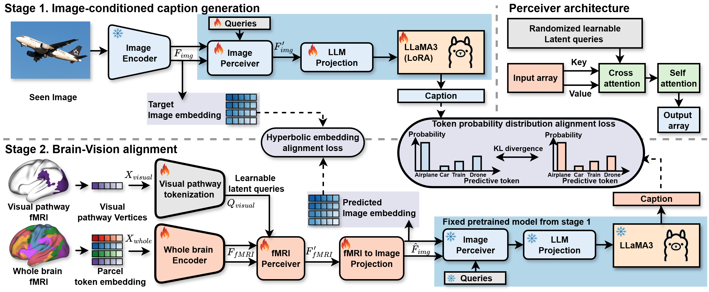

# Image-mediated fMRI-to-caption generation with visual pathway tokens and hyperbolic alignment

Official page of "Image-mediated fMRI-to-caption generation with visual pathway tokens and hyperbolic alignment" (MICCAI 2026)

# Abstract
Generating natural language captions from fMRI remains challenging due to the large modality gap between brain activity and linguistic representations. We propose a two-stage brain-to-caption framework that leverages image embeddings as an intermediary between fMRI and language. In the first stage, a vision-language pipeline learns imageto-caption generation via LLaMA3. In the second stage, fMRI activations are aligned to the image embedding space through three novel components: (1) hyperbolic embedding alignment in the Poincaré ball providing more accurate and stable fMRI-to-image matching than Euclidean alternatives; (2) Token Probability Distribution Alignment (TPDA), which distills next-token distributions from the image-to-caption branch to the fMRI-to-caption branch; and (3) visual pathway tokenization, which converts fine-grained vertex-level visual cortical inputs into query tokens to supplement whole-brain regional features. On the Natural Scenes Dataset, our method achieves a CIDEr score of 56.79, outperforming existing methods. Beyond quantitative gains, neuroscientific analysis reveals the model’s regional activations align with known functional brain specialization of visual pathway areas without explicit word type supervision, suggesting neurobiologically plausible brain-to-language mappings.
